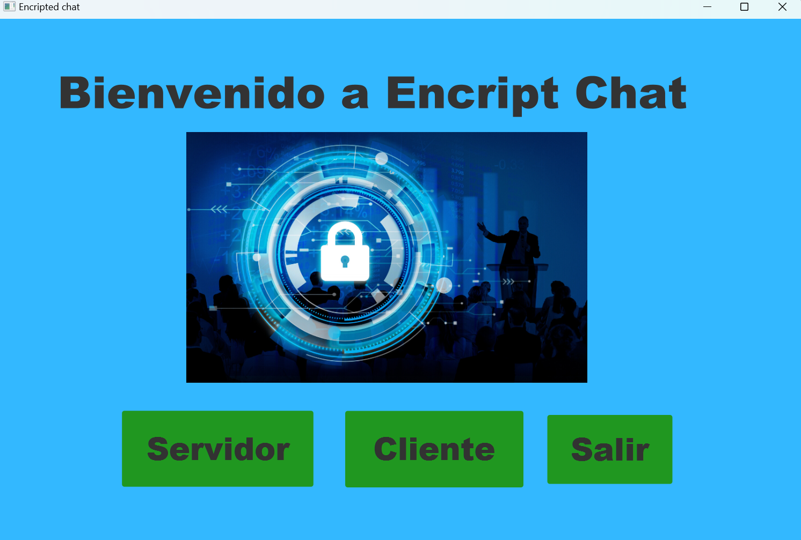
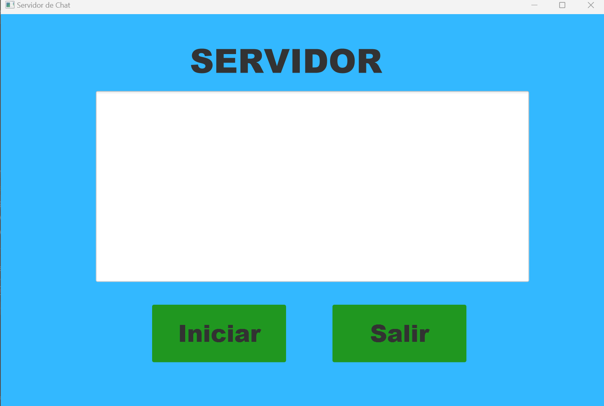
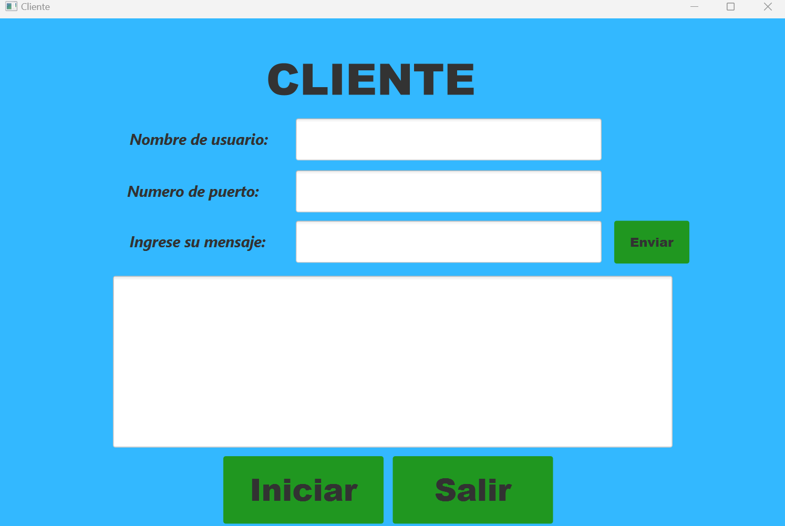
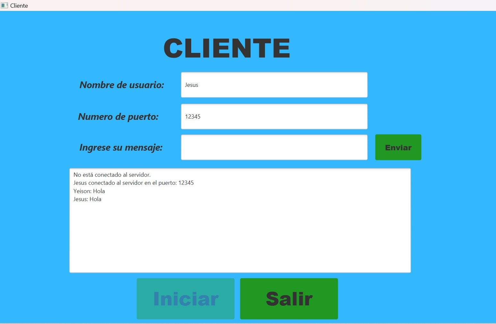

# Encrypted-chat

Encrypted-chat es una aplicación de chat seguro que utiliza el algoritmo de intercambio de claves Diffie-Hellman y el cifrado AES para proporcionar una comunicación segura entre dos usuarios (Clientes).

## Características

- Comunicación segura mediante el intercambio de claves Diffie-Hellman.
- Cifrado de mensajes utilizando el algoritmo AES en modo CBC con relleno PKCS5.
- Interfaz gráfica de usuario simple y fácil de usar.
- Tambien se puede usar mediante la consola en la rama (Console-mode)

## Requisitos

- Java 17 o superior.
- IntelliJ IDEA.
- Bouncy Castle Crypto API.

## Instalación y modo de uso

1. Clona este repositorio en tu máquina local:

   ```bash
   git clone https://github.com/JesusGarce22/Encrypted_chat.git

2. Corre el proyecto (Run clase HelloAplication)


3. Abrir el Servidor dando click en Servidor y dar click en iniciar.



4. Regresa a la pantalla de inicio (sin cerrar el servidor) y da click en Cliente.



5. Ingresa tu nombre de usuario y el numero de puerto en donde esta corriendo el servidor.

6. Abrir otro cliente desde otro equipo o desde tu mismo pc dando click en cliente desde la pantalla de inicio.

7. Una vez estes conectado al Servidor desde dos clientes, Ingresa tu mensaje en el campo "Ingrese su mensaje" y a continuacion de click en enviar.



NOTA: Para finalizar el programa, De click en Salir en cualquiera de las pantallas. Tambien, la direccion ip en donde corre el Servidor debe ser configurada en el codigo directamente. en la clase [Servidor](MP/Chat-End/src/main/java/com/icesi/chatend/servidor/Servidor.java) y en la clase [Cliente](MP/Chat-End/src/main/java/com/icesi/chatend/cliente/Cliente.java).
