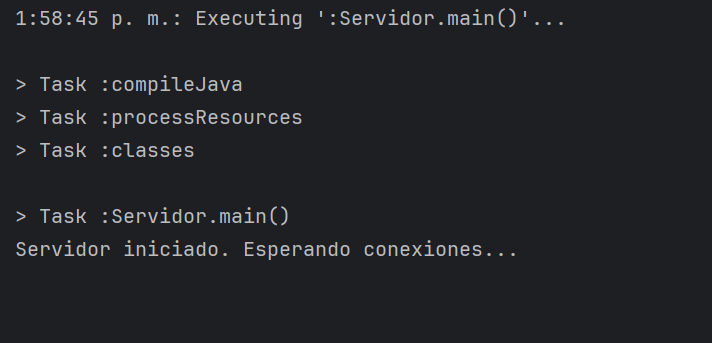
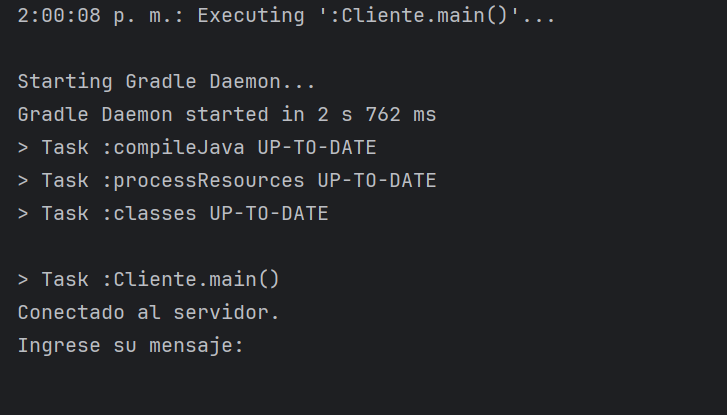

# Encrypted-chat

Encrypted-chat es una aplicación de chat seguro que utiliza el algoritmo de intercambio de claves Diffie-Hellman y el cifrado AES para proporcionar una comunicación segura entre dos usuarios (Clientes).

## Características

- Comunicación segura mediante el intercambio de claves Diffie-Hellman.
- Cifrado de mensajes utilizando el algoritmo AES en modo CBC con relleno PKCS5.
- Interfaz por consola simple y fácil de usar.
- Tambien se puede usar mediante JavaFX en la rama (MAIN)

## Requisitos

- Java 17 o superior.
- IntelliJ IDEA.
- Gradle 8.7
- Bouncy Castle Crypto API.

## Instalación y modo de uso

1. Clona este repositorio en tu máquina local:

   ```bash
   git clone https://github.com/JesusGarce22/Encrypted_chat.git

2. Cambiar de la rama main a Console-mode

3. Iniciar clase Servidor.



4. Iniciar clase Cliente.



NOTA: Si desea conectar dos clientes de manera local, debes iniciar dos instancias de la clase cliente. Si deseas conectar un cliente desde otro PC, debes correr la instancia del cliente.